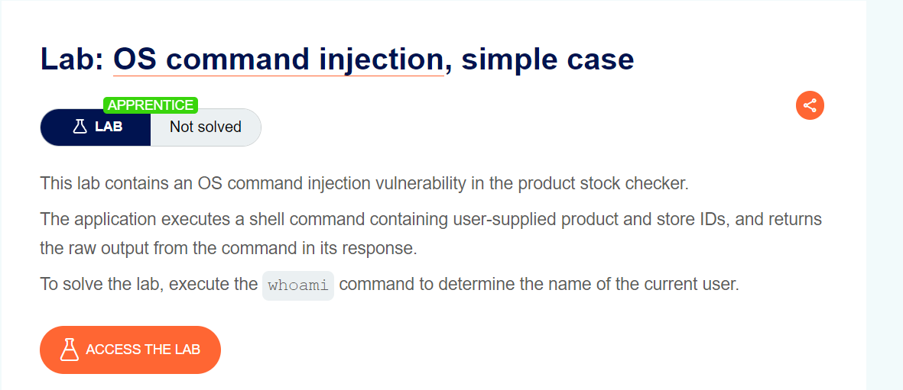
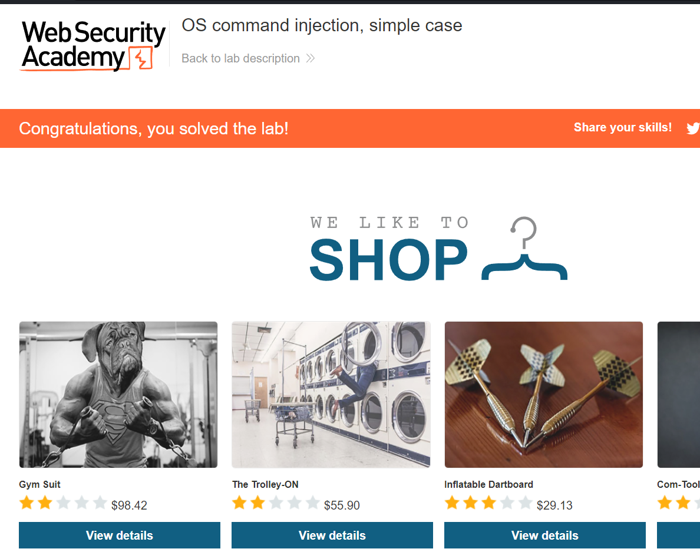
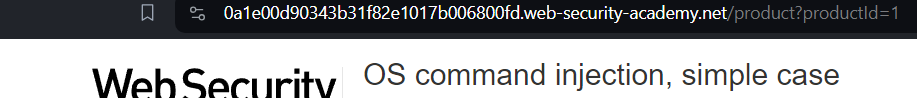
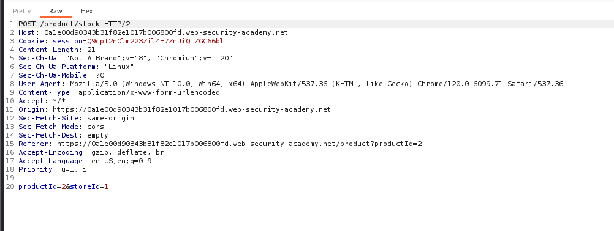
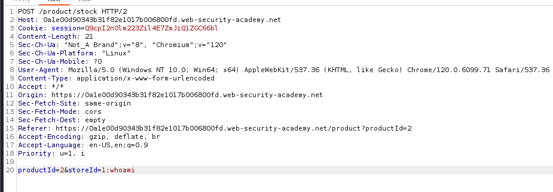
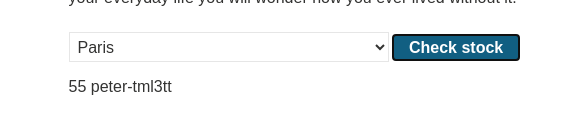

## Lab OS command injection, simple case ##

### Lab Description ###

> So we have retrieve the username using the linux command `whoami`.

> So this target website.

> So we are try to inject os command in this feild but it did'nt work.

> When try to intercept the following request that is used for checking for stock we get the following output below.

> We will try to inject os command in storeid field.

> So we injected the `whomai` command here let's forward it see the output.

> So we get the username!!!.